# 🚀 team-profile

> AWS 클라우드 기반 팀원 프로필 관리 백엔드 서비스
>
> Stateless 아키텍처를 적용해 서버가 죽어도 데이터가 안전하게 유지되며, ALB + ASG 기반 고가용성과 CloudFront CDN 기반 글로벌 성능 최적화까지 완성한 프로덕션급 백엔드 서비스입니다.

---

## 📑 목차

- [프로젝트 개요](#-프로젝트-개요)
- [기술 스택](#-기술-스택)
- [아키텍처](#-아키텍처)
- [API 명세](#-api-명세)
- [LV 0 - AWS Budget](#-lv-0---aws-budget-필수)
- [LV 1 - 네트워크 구축 및 API 배포](#-lv-1---네트워크-구축-및-api-배포-필수)
- [LV 2 - DB 분리 및 보안 연결](#-lv-2---db-분리-및-보안-연결-필수)
- [LV 3 - 프로필 사진 기능과 권한 관리](#-lv-3---프로필-사진-기능과-권한-관리-필수)
- [LV 4 - Docker & CI/CD 파이프라인](#-lv-4---docker--cicd-파이프라인-도전)
- [LV 5 - 고가용성 아키텍처와 HTTPS](#-lv-5---고가용성-아키텍처와-https-도전)
- [LV 6 - CloudFront CDN](#-lv-6---cloudfront-cdn-도전)

---

## 📌 프로젝트 개요

- **프로젝트명**: `team-profile`
- **GitHub**: https://github.com/namdongyeob/team-profile
- **도메인**: https://team-profile.click
- **구현 범위**: **LV 0 ~ LV 6 (전체 완료)** ✅

---

## 🛠 기술 스택

### Backend

- **Java 17** (Amazon Corretto)
- **Spring Boot 4.0.6**
- **Spring Data JPA**
- **Gradle (Groovy)**

### Infra & DevOps

- **AWS**: EC2, VPC, RDS(MySQL), S3, ALB, ASG, Route 53, ACM, CloudFront, Parameter Store, IAM, NAT Gateway
- **Docker** + **Docker Hub**
- **GitHub Actions** (CI/CD)

---

## 📡 API 명세

| Method | Endpoint                          | 설명                         |
|--------|-----------------------------------|----------------------------|
| `POST` | `/api/members`                    | 팀원 정보 저장 (이름, 나이, MBTI)    |
| `GET`  | `/api/members/{id}`               | 팀원 정보 조회                   |
| `POST` | `/api/members/{id}/profile-image` | 프로필 사진 업로드 (S3)            |
| `GET`  | `/api/members/{id}/profile-image` | 프로필 사진 URL 조회 (CloudFront) |
| `GET`  | `/actuator/health`                | 헬스 체크                      |
| `GET`  | `/actuator/info`                  | 팀 정보 조회                    |

---

## ✅ LV 0 - AWS Budget `필수`

> 클라우드 비용 폭탄 방지를 위해 월 예산 $100, 80% 도달 시 이메일 알림 설정

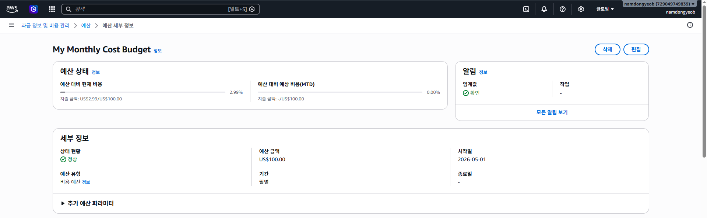

---

## ✅ LV 1 - 네트워크 구축 및 API 배포 `필수`

> Public/Private Subnet 분리된 VPC 구축 후 Public Subnet의 EC2에 Spring Boot 앱 배포

### 📍 EC2 퍼블릭 IP

```
https://team-profile.click/actuator/health
```


### 주요 구현 사항

- VPC + Public/Private Subnet 분리 설계
- Public Subnet에 EC2 생성 및 Spring Boot API 배포
- `application.yml`을 `local/prod` Profile로 분리 (로컬: H2 / 운영: MySQL)
- `[API - LOG]` 형식의 INFO 로깅 + 예외 ERROR 로깅 구현
- Spring Boot Actuator `health` 엔드포인트 노출

---

## ✅ LV 2 - DB 분리 및 보안 연결 `필수`

> Parameter Store로 DB 접속 정보를 분리하고, RDS 보안 그룹 체이닝으로 EC2만 접근 가능하도록 설정

### 📍 Actuator Info 엔드포인트

```
https://team-profile.click/actuator/info
```

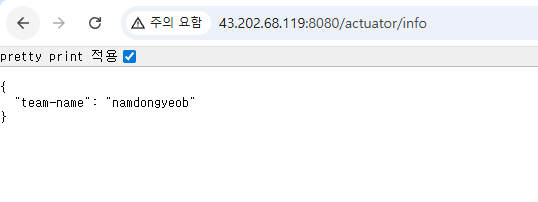
Parameter Store에 저장한 `team-name` 값이 `/actuator/info`로 정상 노출됩니다.

### 📍 RDS 보안 그룹 (인바운드 규칙)

소스에 IP가 아닌 **EC2 보안 그룹 ID**(`sg-xxxxx`)를 지정하여 EC2만 RDS에 접근 가능합니다.

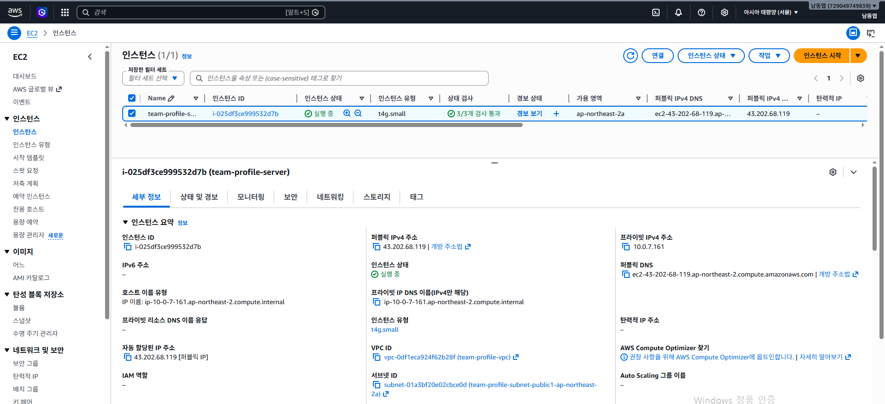

### 주요 구현 사항

- Public Subnet에 MySQL RDS 구축
- **보안 그룹 체이닝**: RDS 인바운드에 EC2 보안 그룹 ID만 허용
- AWS Parameter Store에 `DB_HOST`, `DB_USERNAME`, `DB_PASSWORD`, `team-name` 저장
- Spring Boot 실행 시 `spring.config.import: aws-parameterstore:/team-profile/prod/`로 주입

---

## ✅ LV 3 - 프로필 사진 기능과 권한 관리 `필수`

> S3 버킷 + IAM Role을 통해 Access Key 없이 안전하게 파일 업로드/다운로드 기능 구현

### 📍 IAM Role 적용 (Access Key 미사용)

EC2에 `team-profile-s3-role` 을 부여하여 코드에 Access Key 없이 S3 접근 가능합니다.
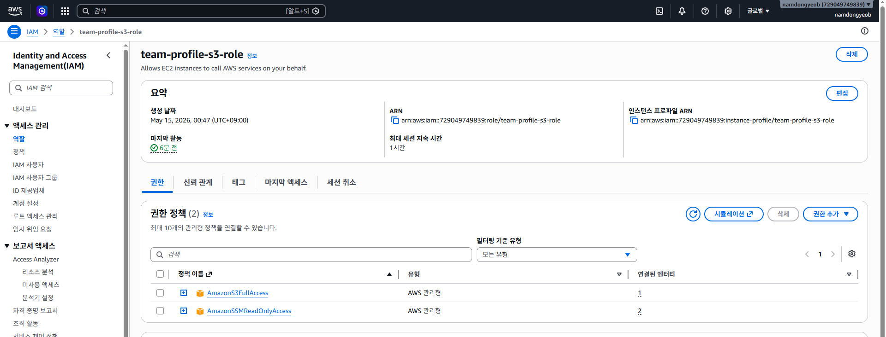

### 📍 Presigned URL 발급 및 접근 성공

> IAM Role 방식으로 진행했으므로 발제 안내에 따라 접근 성공 스크린샷을 첨부합니다.

**Presigned URL 발급 (Postman)**

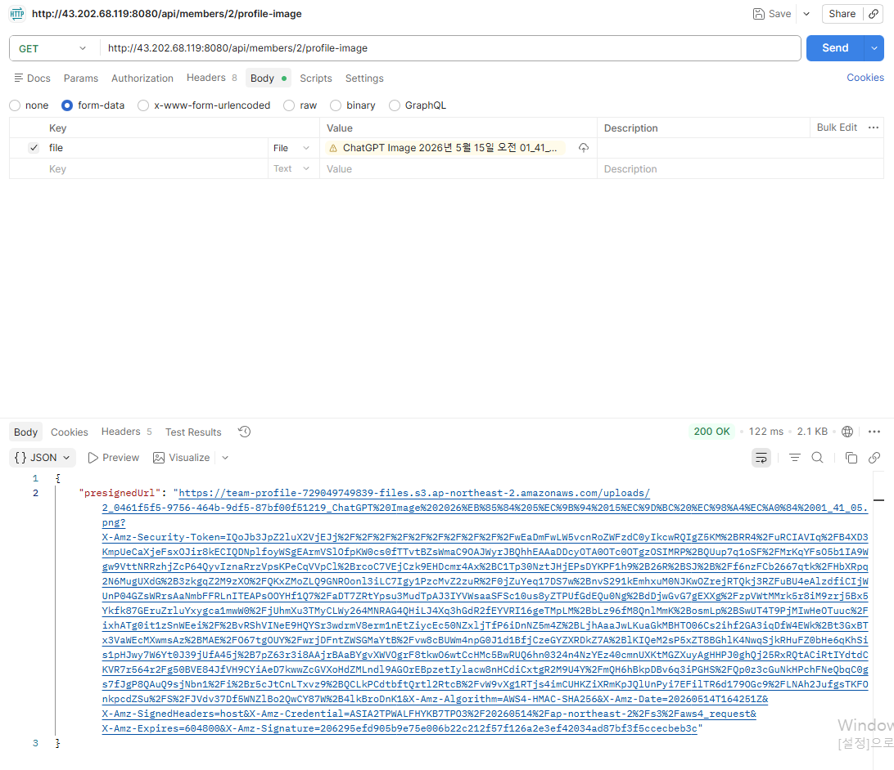

**Presigned URL을 통한 이미지 다운로드 성공**

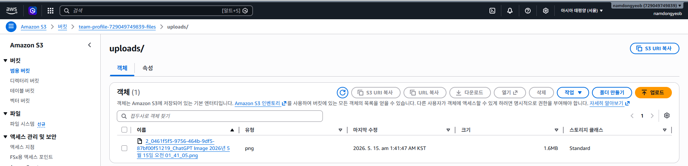

### 주요 구현 사항

- S3 버킷 생성 시 **모든 퍼블릭 액세스 차단**
- `team-profile-s3-role` IAM Role을 EC2에 연결 (Access Key 미사용)
- `POST /api/members/{id}/profile-image`: MultipartFile → S3 업로드 후 key를 DB에 저장
- `GET /api/members/{id}/profile-image`: **Presigned URL (유효기간 7일)** 발급
    - *(LV 6에서 CloudFront URL로 변경됨)*

---

## ✅ LV 4 - Docker & CI/CD 파이프라인 `도전`

> Dockerfile로 애플리케이션 컨테이너화 후, GitHub Actions로 코드 푸시 시 자동 배포

### 📍 GitHub Actions 성공 화면

main 브랜치 푸시 시 Build → Docker Hub Push → EC2 자동 배포까지 완료됩니다.

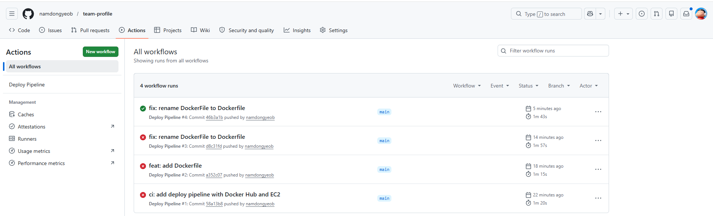

### 📍 EC2 컨테이너 실행 확인

`sudo docker ps` 명령으로 컨테이너가 정상 실행 중임을 확인합니다.

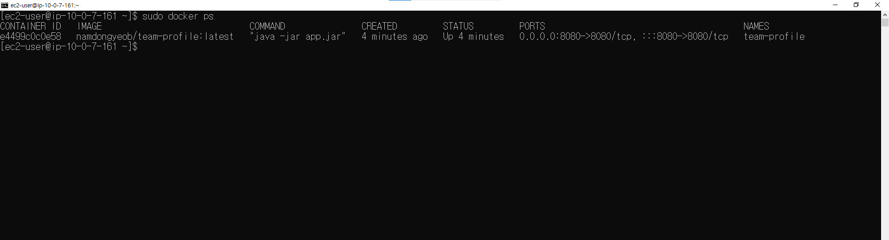

### 주요 구현 사항

- `Dockerfile` 작성 (multi-stage build로 이미지 최적화)
- `.github/workflows/deploy.yml` 작성
    - **CI**: main 브랜치 push 시 build & test
    - **CD**: Docker Hub에 이미지 push 후 EC2에서 자동 pull & run

---

## ✅ LV 5 - 고가용성 아키텍처와 HTTPS `도전`

> Private Subnet + NAT Gateway + ALB + ASG + Route 53 + ACM으로 고가용성 + HTTPS 환경 구축

### 📍 HTTPS 적용 도메인 URL

```
https://team-profile.click
```

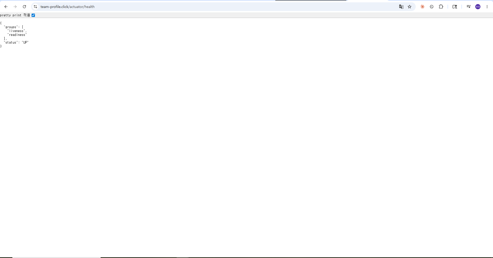

**`/actuator/health` 헬스 체크 성공**

### 📍 Target Group Healthy 상태

ASG가 띄운 EC2 인스턴스가 Target Group에 등록되어 **Healthy** 상태입니다.

### 📍 변경된 RDS 보안 그룹 (Private Subnet)

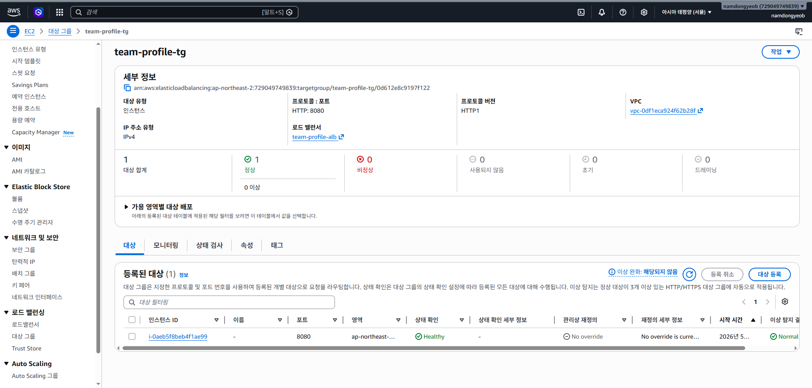

### 주요 구현 사항

- **NAT Gateway** 생성 → Private Subnet의 EC2가 외부와 통신 가능
- EC2와 RDS를 **Private Subnet으로 이전** → 외부에서 직접 접근 불가
- **Route 53**으로 도메인 `team-profile.click` 구매 및 호스팅 영역 생성
- **ACM**으로 SSL 인증서 발급
- **ALB**: HTTPS(443) 리스너에 ACM 인증서 적용, HTTP(80) → HTTPS 리다이렉트
- **Launch Template + Auto Scaling Group** (최소 1, 최대 2)
- **Route 53 Alias 레코드**로 도메인 → ALB 연결

---

## ✅ LV 6 - CloudFront CDN `도전`

> S3 버킷을 원본으로 하는 CloudFront 배포 생성하여 글로벌 이미지 로딩 속도 최적화

### 📍 CloudFront 이미지 URL

```
https://d1o99a9x70rw82.cloudfront.net/uploads/2_0461f5f5-9756-464b-9df5-87bf00f51219_ChatGPT%20Image%202026%EB%85%84%205%EC%9B%94%2015%EC%9D%BC%20%EC%98%A4%EC%A0%84%2001_41_05.png
```

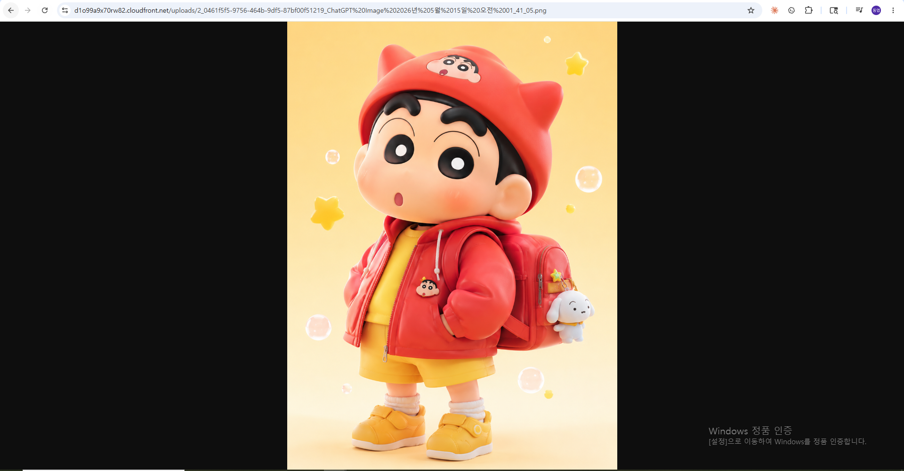

### 주요 구현 사항

- CloudFront 배포 생성 (S3 버킷을 원본으로)
- **OAC (Origin Access Control)** 설정 → S3는 private 유지하면서 CloudFront만 접근 허용
- S3 버킷 정책에 CloudFront 배포 ARN 등록
- Spring Boot `S3Service.getPresignedUrl()` → `getCloudFrontUrl()`로 변경
- `application-prod.yml`에 CloudFront 도메인 추가

---

## 🧹 사용한 AWS 리소스 정리 안내

> 과제 검증 후 비용 발생 방지를 위해 다음 리소스를 정리할 예정입니다.

- [ ] EC2 인스턴스 종료 (Terminate)
- [ ] Auto Scaling Group 삭제
- [ ] RDS 삭제
- [ ] NAT Gateway 삭제 ⚠️ (시간당 과금)
- [ ] ALB 삭제
- [ ] Elastic IP 릴리스
- [ ] S3 버킷 비우기 후 삭제
- [ ] Route 53 호스팅 영역 삭제
- [ ] CloudFront 배포 비활성화 후 삭제

---
